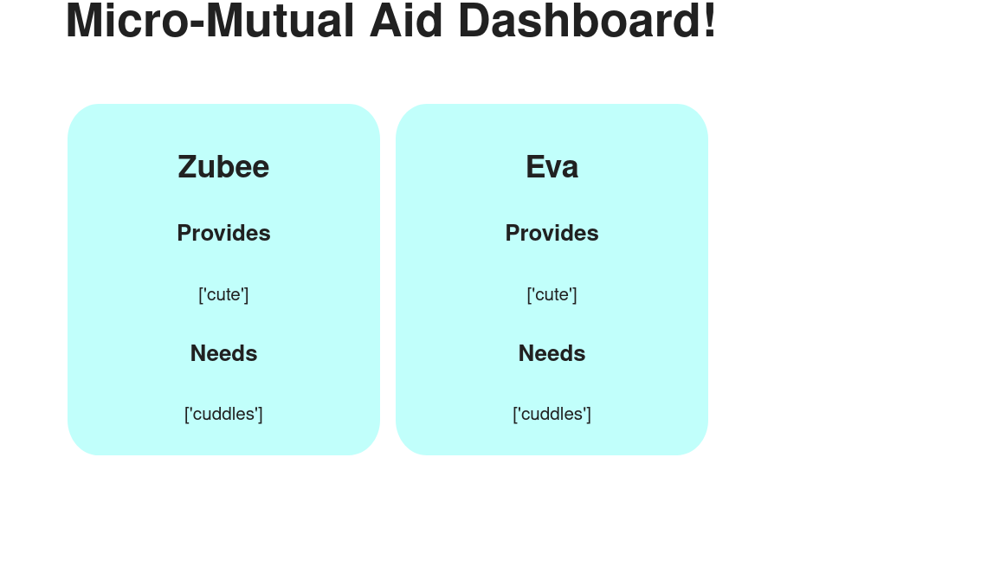

# Micro-Mutual Aid Dashbord (MMAD!) ( ｡ •̀ ᴖ •́ ｡)


## Overview
This is a web application that stores & presents community member's needs & offering to help Mutual Aid micro-clusters build toward collective survival.



## Setup

```pip3 install -r requirements.txt ```
export a SECRET_KEY env variable: ```export SECRET_KEY="{insert key}"```

## Usage

### Starting the Web server 

run the manager script from the root diectory: ```python3 manage.py```

run unit tests: ```python3 -m unittest```

### Running tests

run all unit tests: ```python3 -m unittest tests```
run a specific unit test: ``` python3 -m unittest tests.<file>.<class>.<method>```


## Techical Details: Application Layout

### /

core Flask & project files

#### /app

the Flask application. Notice the __init__ package constructor, which contains the application factory method (see section below).
This folder also contains view, templates, and other application resources.

##### /app/main

Within the flask app, the main folder houses the 'main' blueprint.  For more information about Blueprints, see the Application Factory section of this doc.


## Technical Details

### Application Factory (where is my app object?)

Perhaps where this project deviates from the most ubiquitious Flask setup is in using the application factory. In the most basic Flask setup, the appliction loop is invoked within the global scope, which limits dynamic configuation options. The factory pattern is a tool to allow the applicaiton to be invoked dynamically from different configuration contexts. This is important to enable unit testing as well as separation of intances across deployment environments. This pattern is described further by Grinberg [1].

#### Show me the Blueprints!

The application factory pattern necessitates implementation of Flasks Blueprint package-- because the app is no longer in the global scope, resources such as routes by default are created too late. Blueprints allow these resources to be declared in the global scope, in a dormant state until registered at runtime.

## Contributors

Riley Chapman (r@riley.rest)
Ritchie Danna (rddanna@gmail.com)

## References & Credits
 
[1] The patterns present here are strongly inspired by the textbook Flask Web Development, by Miguel Grinberg. This text is freely available here: [implement link]